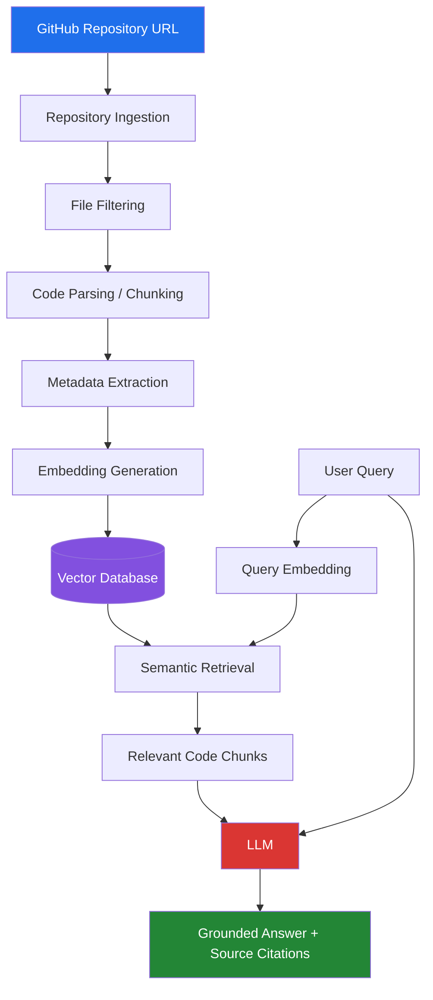

<div align="center">


[](https://www.python.org/)
[](https://fastapi.tiangolo.com/)
[](https://github.com/astral-sh/uv)
[](https://github.com/facebookresearch/faiss)
[](LICENSE)


<sub>Replace <code>&lt;your-username&gt;</code> above once pushed — badges go live automatically, no config needed.</sub>

</div>

<br>

<p align="center">
  <a href="#overview">Overview</a> •
  <a href="#architecture">Architecture</a> •
  <a href="#quick-start">Quick Start</a> •
  <a href="#api-reference">API</a> •
  <a href="#roadmap">Roadmap</a> •
  <a href="#faq">FAQ</a>
</p>


---

## Overview

Dropping into an unfamiliar codebase is slow. Reading through hundreds of files to answer a simple question — *"where is authentication handled?"* — burns hours that should take minutes.

**Codent** points at any GitHub repository and lets you ask it questions in plain English, then answers using the **actual code**, not a guess:

<table>
<tr><td>

```
🗣️  "Where is authentication handled?"
🗣️  "How does checkout work?"
🗣️  "Which files use PaymentService?"
🗣️  "Explain this repository."
🗣️  "If I change this file, what could be affected?"
```

</td></tr>
</table>

Every answer comes back **grounded** — with file names, function names, and exact line numbers cited, so you can verify it instead of trusting it blindly.

> **Codent understands, navigates, and explains code.**
> It does not lint, scan for vulnerabilities, or flag bugs — that's a different tool solving a different problem.

<details>
<summary><b>💡 Why not just ask ChatGPT / Claude directly?</b></summary>
<br>

Because a general LLM has never seen your repository. It will either refuse, or worse, confidently hallucinate a plausible-sounding answer. Codent retrieves the *real* relevant code first, and forces the LLM to answer only from that — every claim is traceable to a specific file and line range.

</details>

---

## Architecture

Codent is a retrieval-augmented generation (RAG) pipeline purpose-built for source code, not prose.



<details>
<summary><b>🔍 Click to see why each stage exists</b></summary>
<br>

| Stage | Problem it solves |
|---|---|
| **File Filtering** | Lockfiles, `node_modules`, and minified bundles would drown real code in noise. |
| **AST-based Chunking** | Whole files are too coarse for retrieval — a 2,000-line file isn't "the answer" to anything. Chunking by function/class means retrieval returns *exactly* the relevant code. |
| **Metadata-first** | Every chunk carries `file`, `function`, `start_line`, `end_line` — this is what makes citations *accurate*, not approximate. |
| **Semantic Retrieval** | Keyword search fails on paraphrased questions ("checkout" vs. `process_order`). Embeddings match by meaning. |
| **Grounded LLM answers** | The LLM only sees retrieved code — it can't answer from guesswork about a repo it's never seen in full. |

</details>

---

## Tech Stack

<table>
<tr>
<td width="50%" valign="top">

**Backend** — shipped


- Python 3.12 + FastAPI
- `uv` for dependency management
- GitHub REST API (repo/tree/blob endpoints)
- `sentence-transformers` for embeddings
- FAISS for vector search
- pgvector / PostgreSQL *(planned)*

</td>
<td width="50%" valign="top">

**Frontend** — planned


- Next.js / React
- Repository input + indexing status
- Chat interface with streaming answers
- Inline source citations
- Embedded code viewer

</td>
</tr>
</table>

---

## Quick Start

```bash
# Clone
git clone https://github.com/<your-username>/codent.git
cd codent/backend

# Install dependencies (uv creates the venv automatically)
uv sync

# (Optional but recommended) set a GitHub token to avoid rate limits
export GITHUB_TOKEN=ghp_xxxxxxxxxxxx        # macOS/Linux
$env:GITHUB_TOKEN="ghp_xxxxxxxxxxxx"        # Windows PowerShell

# Run the API
uv run uvicorn app.main:app --reload
```

<div align="center">

**Server:** `http://127.0.0.1:8000` &nbsp;•&nbsp; **Interactive docs:** `http://127.0.0.1:8000/docs`

</div>

---

## API Reference

<details open>
<summary><b>▸ <code>GET /health</code></b> — liveness check</summary>
<br>

```bash
curl http://127.0.0.1:8000/health
```
```json
{ "status": "ok" }
```

</details>

<details open>
<summary><b>▸ <code>POST /ingest</code></b> — fetch, filter, and chunk a repository</summary>
<br>

```bash
curl -X POST http://127.0.0.1:8000/ingest \
  -H "Content-Type: application/json" \
  -d '{"url": "https://github.com/pallets/flask"}'
```

```json
{
  "owner": "pallets",
  "name": "flask",
  "default_branch": "main",
  "raw_file_count": 214,
  "filtered_file_count": 87,
  "chunk_count": 512,
  "sample_chunks": [
    {
      "file": "src/flask/app.py",
      "name": "Flask",
      "kind": "class",
      "start_line": 42,
      "end_line": 118
    }
  ]
}
```

Every chunk is traceable back to an exact file and line range — this is the metadata contract the entire retrieval and citation system is built on.

</details>

---

## Project Structure

<details>
<summary><b>📁 Click to expand full folder tree</b></summary>

```
codent/
└── backend/
    ├── app/
    │   ├── main.py                    # FastAPI app + routes
    │   ├── github.py                  # GitHub API client + URL validation
    │   └── processing/
    │       ├── file_filter.py         # Noise removal + language detection
    │       └── chunker.py             # AST-based function/class chunking
    ├── tests/
    │   ├── test_github.py
    │   ├── test_file_filter.py
    │   └── test_chunker.py
    └── pyproject.toml
```

</details>

---

## Roadmap

Codent is built in verifiable phases — every checked box below has passing tests behind it.

```
Progress: ████████████░░░░░░░░░░░░░░░░  4 / 11 phases
```

- [x] **Phase 1** — Project setup (FastAPI + uv, health endpoint)
- [x] **Phase 2** — GitHub ingestion (URL validation, API client, file fetching)
- [x] **Phase 3** — File filtering (noise removal, language detection)
- [x] **Phase 4** — Code chunking (AST-based, function/class-level, line-accurate)
- [x] **Phase 5** — Embeddings (`sentence-transformers`)
- [x] **Phase 6** — Vector search (FAISS index + retrieval)
- [x] **Phase 7** — RAG (retrieved code + query → LLM)
- [x] **Phase 8** — Source citations (file/function/line/GitHub links)
- [x] **Phase 9** — Codebase understanding (architecture-level Q&A)
- [x] **Phase 10** — Change-impact analysis (dependency graph, blast radius)
- [x] **Phase 11** — Frontend (Next.js chat UI + code viewer)

---

## Testing

```bash
uv run pytest -v
```

Every module — GitHub ingestion, file filtering, chunking — ships with unit tests, including mocked GitHub API calls so the suite runs instantly with zero network dependency.

---

## FAQ

<details>
<summary><b>Does this only work with Python repos?</b></summary>
<br>

No. Python gets precise AST-based chunking (function/class-level with exact line numbers). Every other language currently falls back to fixed-size block chunking, with tree-sitter-based parsing for JS/TS/Go/etc. planned as a later phase.

</details>

<details>
<summary><b>Does Codent store my code anywhere permanently?</b></summary>
<br>

Chunks and embeddings are stored in a local vector index (FAISS, with pgvector planned) for retrieval — not sent anywhere beyond the LLM API call needed to answer a query.

</details>

<details>
<summary><b>How is this different from GitHub Copilot Chat?</b></summary>
<br>

Copilot Chat is tuned for writing and editing code inline. Codent is built specifically for **onboarding and comprehension** — answering "how does X work" and "what breaks if I change Y" across an entire unfamiliar repo, with citations you can check line-by-line.

</details>

---

<div align="center">

### Built by **Sapna Singh**

<a href="https://github.com/sapna71/sapna71"></a>
<a href="https://www.linkedin.com/in/sapna-singh-9a652332a?"></a>

*Feedback, issues, and contributions welcome.*

</div>
